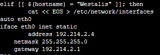

# Jarkom-Modul-3-ITA10-2022
**Laporan Resmi praktikum Jarkom kelompok ITA10**
 
Kelompok:
- Hafizh Abid Wibowo (5027201011)
- Muhammad Farrel Abdillah (50272010570)
 
Berikut adalah Dokumentasi dan langkah pengerjaan untuk laporan resmi praktikum jarkom modul 3
 

# **Konfigurasi: Topologi**

 
 Berikut adalah screenshot konfigurasi dari node dalam topologi
 
  
 Wise - DNS Server:
  
 
 
  
 Westalis - DHCP Server:
  
 
 
  
 Berlint - Proxy Server:
  
 
 
  
 Ostania - DHCP Relay:
  
 
 
  
 
# **Langkah Pengerjaan: DHCP**
- Semua client yang ada HARUS menggunakan konfigurasi IP dari DHCP Server.
  Konfigurasi pada setiap client dengan konfigurasi IP sesuai dari DHCP Server:
   
  
  
- Client yang melalui Switch1 mendapatkan range IP dari [prefix IP].1.50 - [prefix IP].1.88 dan [prefix IP].1.120 - [prefix IP].1.155
- Client yang melalui Switch3 mendapatkan range IP dari [prefix IP].3.10 - [prefix IP].3.30 dan [prefix IP].3.60 - [prefix IP].3.85
- Client mendapatkan DNS dari WISE dan client dapat terhubung dengan internet melalui DNS tersebut
- Lama waktu DHCP server meminjamkan alamat IP kepada Client yang melalui Switch1 selama 5 menit sedangkan pada client yang melalui Switch3 selama 10 menit. Dengan waktu maksimal yang dialokasikan untuk peminjaman alamat IP selama 115 menit.
- Loid dan Franky berencana menjadikan Eden sebagai server untuk pertukaran informasi dengan alamat IP yang tetap dengan IP [prefix IP].3.13

# **Langkah Pengerjaan: Proxy**
SSS, Garden, dan Eden digunakan sebagai client Proxy agar pertukaran informasi dapat terjamin keamanannya, juga untuk mencegah kebocoran data. Pada Proxy Server di Berlint, Loid berencana untuk mengatur bagaimana Client dapat mengakses internet. Artinya setiap client harus menggunakan Berlint sebagai HTTP & HTTPS proxy. Adapun kriteria pengaturannya adalah sebagai berikut:
- Client hanya dapat mengakses internet diluar (selain) hari & jam kerja (senin-jumat 08.00 - 17.00) dan hari libur (dapat mengakses 24 jam penuh)
- Adapun pada hari dan jam kerja sesuai nomor (1), client hanya dapat mengakses domain loid-work.com dan franky-work.com (IP tujuan domain dibebaskan)
- Saat akses internet dibuka, client dilarang untuk mengakses web tanpa HTTPS. (Contoh web HTTP: http://example.com)
- Agar menghemat penggunaan, akses internet dibatasi dengan kecepatan maksimum 128 Kbps pada setiap host (Kbps = kilobit per second; lakukan pengecekan pada tiap host, ketika 2 host akses internet pada saat bersamaan, keduanya mendapatkan speed maksimal yaitu 128 Kbps)
- Setelah diterapkan, ternyata peraturan nomor (4) mengganggu produktifitas saat hari kerja, dengan demikian pembatasan kecepatan hanya diberlakukan untuk pengaksesan internet pada hari libur
 

