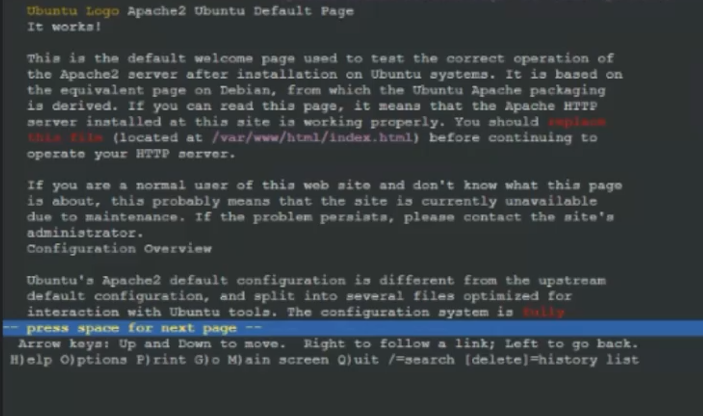

# Jarkom-Modul-3-ITA10-2022
**Laporan Resmi praktikum Jarkom kelompok ITA10**
<br>
Kelompok:
- Hafizh Abid Wibowo (5027201011)
- Muhammad Farrel Abdillah (50272010570)
<br>
Berikut adalah Dokumentasi dan langkah pengerjaan untuk laporan resmi praktikum jarkom modul 3
<br>

# **Konfigurasi: Topologi**

<br>
 Berikut adalah screenshot konfigurasi dari node dalam topologi
 
 <br>
 WISE - DNS Server:
 <br>
 
 
 <br>
 Westalis - DHCP Server:
 <br>
 
 
 <br>
 Berlint - Proxy Server:
 <br>
 
 
 <br>
 Ostania - DHCP Relay:
 <br>
 
 
 <br>

# **Soal Shift: DHCP**
- Semua client yang ada HARUS menggunakan konfigurasi IP dari DHCP Server.
- Client yang melalui Switch1 mendapatkan range IP dari [prefix IP].1.50 - [prefix IP].1.88 dan [prefix IP].1.120 - [prefix IP].1.155 
- Client yang melalui Switch3 mendapatkan range IP dari [prefix IP].3.10 - [prefix IP].3.30 dan [prefix IP].3.60 - [prefix IP].3.85 
- Client mendapatkan DNS dari WISE dan client dapat terhubung dengan internet melalui DNS tersebut.
- Lama waktu DHCP server meminjamkan alamat IP kepada Client yang melalui Switch1 selama 5 menit sedangkan pada client yang melalui Switch3 selama 10 menit. Dengan -     waktu maksimal yang dialokasikan untuk peminjaman alamat IP selama 115 menit. 
- Loid dan Franky berencana menjadikan Eden sebagai server untuk pertukaran informasi dengan alamat IP yang tetap dengan IP [prefix IP].3.13.

# **Langkah Pengerjaan: DHCP**
- Menginstall isc-dhcp-relay pada Ostania untuk membuatnya menjadi DHCP Relay.
  <br>
  
  <br>
  <br>
  dan Menambahkan:
  ```
  SERVERS="192.214.2.4"
  INTERFACES="eth1 eth2 eth3"
  OPTIONS=""
  ```
  pada /etc/default/isc-dhcp-relay.
  <br>
  <br>
  Setelah itu, melakukan ```service isc-dhcp-relay restart``` untuk mengonfirmasi perubahan pada relay.
  <br>
- Menginstall isc-dhcp-server pada Westalis untuk membuatnya menjadi DHCP Server.
  <br>
  
  <br>
  <br>
  dan Menambahkan ```INTERFACES="eth0"``` pada /etc/default/isc-dhcp-server
  <br>
- pada /etc/dhcp/dhcpd.conf, akan ditambahkan config untuk menjalankan relay yaitu:
  ```
  subnet 192.214.2.0 netmask 255.255.255.0 {}
  ```
  <br>
  Peminjaman IP akan dilakukan dengan waktu default dan maximum tertentu yang telah diarahkan ke IP WISE (192.214.2.2).
  Untuk melakukan hal tersebut, akan dilakukan penambahan config pada Switch1 dengan:
  
  ```
  subnet 192.214.1.0 netmask 255.255.255.0 {
    range 192.214.1.50 192.214.1.88;
    range 192.214.1.120 192.214.1.155;
    option routers 192.214.1.1;
    option broadcast-address 192.214.1.255;
    option domain-name-servers 192.214.2.2;
    default-lease-time 300;
    max-lease-time 6900;
  }
  ```
  Sementara pada Switch3 akan ditambahkan config:
  
  ```
  subnet 192.214.3.0 netmask 255.255.255.0 {
    range 192.214.3.10 192.214.3.30;
    range 192.214.3.60 192.214.3.85;
    option routers 192.214.3.1;
    option broadcast-address 192.214.1.255;
    option domain-name-servers 192.214.2.2;
    default-lease-time 600;
    max-lease-time 6900;
  }
  ```
 
  Melakukan ```service isc-dhcp-server restart``` untuk restart pada DHCP Server.
  
  <br>
- Untuk membuat semua user pada Switch1 dan Switch3 sesuai dengan DHCP Server, akan dilakukan perubahan pada setiap konfigurasinya menjadi:
  <br>
  
  <br>
- Melakukan peninstallan bind pada WISE
  ```
  elif [[ $(hostname) = "WISE" ]]; then
    apt update
    apt install \
    apache2 \
    bind9 -y
  ```
  
- Dalam node WISE akan ditambahkan: 

  ```
  options {
    directory "/var/cache/bind";
 
    forwarders {
            192.168.122.1;
    };
 
    allow-query { any; };
 
    auth-nxdomain no;    # conform to RFC1035
    listen-on-v6 { any; };
  };
  ``` 
  pada /etc/bind/named.conf.options
  <br>
  
  ```forwarders {ip}``` sendiri berguna sebagai DNS Forwarder kepada IP yang dituju.
  <br>
- Untuk menjadikan Eden sebagai server pertukaran informasi dengan alamat IP tetap yang telah ditentukan ([Prefix IP].3.13), pertama-tama kita akan mengubah             /etc/network/interfaces pada Eden menjadi:
  <br>
  
  <br>
  <br>
  Setelah itu, dalam Westalis ditambahkan:
  
  ```
  host Eden {
    hardware ethernet 46:37:0c:a6:58:22;
    fixed-address 192.214.3.13;
  }
  ```
  pada /etc/dhcp/dhcpd.conf untuk mengubah fixed address nya.
  <br>
  
# **Soal Shift: Proxy**
SSS, Garden, dan Eden digunakan sebagai client Proxy agar pertukaran informasi dapat terjamin keamanannya, juga untuk mencegah kebocoran data. Pada Proxy Server di Berlint, Loid berencana untuk mengatur bagaimana Client dapat mengakses internet. Artinya setiap client harus menggunakan Berlint sebagai HTTP & HTTPS proxy. Adapun kriteria pengaturannya adalah sebagai berikut:
- Client hanya dapat mengakses internet diluar (selain) hari & jam kerja (senin-jumat 08.00 - 17.00) dan hari libur (dapat mengakses 24 jam penuh)
- Adapun pada hari dan jam kerja sesuai nomor (1), client hanya dapat mengakses domain loid-work.com dan franky-work.com (IP tujuan domain dibebaskan)
- Saat akses internet dibuka, client dilarang untuk mengakses web tanpa HTTPS. (Contoh web HTTP: http://example.com)
- Agar menghemat penggunaan, akses internet dibatasi dengan kecepatan maksimum 128 Kbps pada setiap host (Kbps = kilobit per second; lakukan pengecekan pada tiap host, ketika 2 host akses internet pada saat bersamaan, keduanya mendapatkan speed maksimal yaitu 128 Kbps)
- Setelah diterapkan, ternyata peraturan nomor (4) mengganggu produktifitas saat hari kerja, dengan demikian pembatasan kecepatan hanya diberlakukan untuk pengaksesan internet pada hari libur
<br>


# **Langkah Pengerjaan: Proxy**
- Karena Berlint akan dijadikan proxy server, maka kami melakukan penginstallan Squid pada Berlint:
  ```
  elif [[ $(hostname) = "Berlint" ]]; then
    apt update
    apt install \
    squid -y
  ```
- Setelah itu mengaplikasikan lynx pada beberapa node karena SSS, Garden, dan Eden dijadikan sebagai client proxy
  ```
  elif [[ $(hostname) = "Eden" ]]; then
    apt update
    apt install \
    lynx \
    speedtest-cli -y
  ```
  ```
  elif [[ $(hostname) = "SSS" ]]; then
    apt update
    apt install \
    lynx \
    speedtest-cli -y
  ```
  ```
  elif [[ $(hostname) = "Garden" ]]; then
    apt update
    apt install \
    lynx \
    speedtest-cli -y
  ```
  Selain itu, akan dilakukan penginstallan client speedtest untuk menguji speed limit sesuai dengan tabel.
- Melakukan konfigurasi menuju domain yang akan diakses yaitu loid-work.com dan franky-work.com:
  <br>
  
  <br>
  <br>
  
  <br>
  <br>
  
  <br>

- Menentukan HTTP port dengan:
  ```
  http_port 8080
  dns_nameservers 192.214.2.2
  ```
  dan menambahkan dns_nameserver agar bisa connect menuju domain loid-work dan franky-work.
  
- Agar dapat membagi kebutuhan/restriction sesuai dengan soal shift dengan rapi, dalam directory Squid akan dimasukan konfigurasi acl seperti berikut:
  ```
    cat << EOS > /etc/squid/squid.conf
  include /etc/squid/acl-time.conf
  include /etc/squid/acl-bandwidth.conf
  include /etc/squid/acl-port.conf
  ``` 
  
- Dengan dimasukkan nya beberapa konfigurasi tersebut, kita dapat menentukan batasan-batasan sesuai dengan instruksi soal shift:
  <br>
  ```
  visible_hostname Berlint
  ```
  1. Client hanya dapat mengakses internet diluar (selain) hari & jam kerja (senin-jumat 08.00 - 17.00) dan hari libur (dapat mengakses 24 jam penuh)
     ```
     http_access allow !WORKING_HOUR_TIME
     http_access deny all
     ```
     ```
        cat << EOS > /etc/squid/acl-time.conf
     acl WORKING_HOUR_TIME time MTWHF 08:00-16:59
     acl WEEKEND_TIME time SA 00:00-23:59
     ```
  2. Adapun pada hari dan jam kerja sesuai nomor (1), client hanya dapat mengakses domain loid-work.com dan franky-work.com (IP tujuan domain dibebaskan).
     ```
     acl WORKING_HOUR_SITES dstdomain "/etc/squid/working-hour-sites.acl"
     ```
     ```
       cat << EOS > /etc/squid/working-hour-sites.acl
     loid-work.com
     franky-work.com
     ```
  3. Saat akses internet dibuka, client dilarang untuk mengakses web tanpa HTTPS. (Contoh web HTTP: http://example.com)
     ```
       cat << EOS > /etc/squid/acl-port.conf
     acl HTTPS_PORT port 443
     acl CONNECT method CONNECT
     ``` 
     ```
     http_access deny !HTTPS_PORT
     http_access deny CONNECT !HTTPS_PORT
     ```
  4. Agar menghemat penggunaan, akses internet dibatasi dengan kecepatan maksimum 128 Kbps pada setiap host (Kbps = kilobit per second; lakukan pengecekan pada tiap        host, ketika 2 host akses internet pada saat bersamaan, keduanya mendapatkan speed maksimal yaitu 128 Kbps)
     ```
       cat << EOS > /etc/squid/acl-bandwidth.conf
     delay_pools 1
     delay_class 1 1
     delay_access 1 allow WEEKEND_TIME
     delay_parameters 1 16000/16000
     ```  
  5. Setelah diterapkan, ternyata peraturan nomor (4) mengganggu produktifitas saat hari kerja, dengan demikian pembatasan kecepatan hanya diberlakukan untuk                pengaksesan internet pada hari libur
     <br>
     <br>
     
     <br>
     <br>
     Dengan beberapa pembatasan seperti diatas, maka hasil akhir script proxy adalah sebagai berikut:
     ```
        acl WORKING_HOUR_SITES dstdomain "/etc/squid/working-hour-sites.acl"
 
      http_access allow WORKING_HOUR_SITES WORKING_HOUR_TIME
 
      http_access deny !HTTPS_PORT
      http_access deny CONNECT !HTTPS_PORT
 
      http_access allow !WORKING_HOUR_TIME
      http_access deny all
 
      visible_hostname Berlint
      EOS
 
        cat << EOS > /etc/squid/acl-time.conf
      acl WORKING_HOUR_TIME time MTWHF 08:00-16:59
      acl WEEKEND_TIME time SA 00:00-23:59
      EOS
 
        cat << EOS > /etc/squid/working-hour-sites.acl
      loid-work.com
      franky-work.com
      EOS
 
        cat << EOS > /etc/squid/acl-bandwidth.conf
      delay_pools 1
      delay_class 1 1
      delay_access 1 allow WEEKEND_TIME
      delay_parameters 1 16000/16000
      EOS
 
        cat << EOS > /etc/squid/acl-port.conf
      acl HTTPS_PORT port 443
      acl CONNECT method CONNECT
      EOS
 
      service squid restart
     ```
- Apabila dapat diakses, tampilan akan seperti ini:
  <br>
  
  <br>
- Dan apabila tidak dapat diakses, tampilan akan seperti ini:
  <br>
  
  <br>

# **Kesulitan dalam Pengerjaan**
- Pada saat soal shift dirilis, terdapat kalimat instruksi yang tidak sesuai. Namun sudah diperbaiki setelah revisi soal shift.
- Terkadang saat melakukan percobaan bagian proxy, syntax dalam script tidak work sehingga ketentuan pada tabel seperti jam/hari akses internet tidak berjalan sesuai dengan script. Hal yang sama juga berlaku pada pembatasan speed atau speedtesting.
